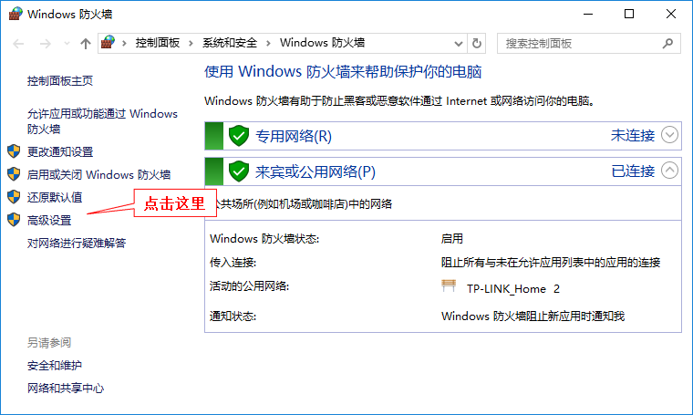

# 1. 数据库介绍和MySQL安装

## 1.1 数据库的概念和一些说明

　　顾名思义，数据库就是“存储数据的仓库”。数据的存储非常重要，可以说，数据就是企业的灵魂，如银行储户信息的存储、员工资料的存储、电商网站商品信息和订单信息的存储等等。我们以后学习的Java EE也是跟数据库打交道。

　　在数据库软件出现之前，程序中单纯用文件来存储需要永久保留的信息，但是当数据量大、并发性高等情况出现时，单纯用文件来存储信息会遇到很多问题。这才导致数据库的产生。数据库专门用于有效的管理数据，关于更多的内容，大家应该阅读书籍《数据库系统概念（本科教学版）》的前几章。

　　现在主流的大部分数据库都是关系型数据库，即数据存放在二维表中，然后表与表之间有一定的关系。通过数据库存储数据，我们就能使用SQL语言来准确迅速的操作数据表的数据和查询数据表的数据。因此我们也要学习SQL语句。

　　SQL语句是根据标准使用的，但是不同的数据库软件还是有微小的区别。常见的关系型数据库有：Oracle、SQL Server和MySQL。Oracle数据库是甲骨文公司开发的大型数据库，适合大型应用；SQL Server是微软开发的数据库软件，与Windows平台结合较好；MySQL的社区（Community）版是免费开源的产品，适合中小企业使用。

　　我们以MySQL数据库产品为例，推荐先学习《MySQL数据库应用：从入门到精通》这个入门书。本教程重点在于介绍用Java连接数据库来获取数据库中的数据，因此下面针对MySQL，讲解MySQL的安装，并且讲解在MySQL中使用常用的SQL语句和一些技术点，相当于是总结使用。还是推荐大家先学习《数据库系统概念》（只看前面几章即可，毕竟后面的太难，实际中也用不到）和《MySQL数据库应用：从入门到精通》，如果有数据库知识，可直接往下看。不排除以后单独推出数据库的教程，到时再做修改。

## 1.2 MySQL的安装

　　推荐在镜像网站上下载MySQL的Windows 64位MSI安装版本。地址：http://mirrors.sohu.com/mysql 。我们选择MySQL-5.7目录中的文件“mysql-5.7.17-winx64.msi”下载安装。这是目前的最新版本。

　　点击msi文件进行安装，注意选择合适的安装位置（我选择的位置是D:\DevTools\MySQL）。这里的安装过程只相当于解压文件了，具体的安装还需要我们手动执行。步骤如下：

　　（1）进入安装目录，在这里我就进入D:\DevTools\MySQL目录。将MySQL资源中提供的my.ini配置文件复制到此目录，并且在此目录新建一个文件夹名为“Uploads”。注意，如果你选择的安装目录在其他位置，则应修改my.ini文件中凡是出现“D:/DevTools/MySQL”的地方，换成自己的安装目录。

　　（2）进入MySQL安装目录的bin目录，并在此目录用“管理员”身份打开控制台。

　　（3）在控制台执行如下命令：mysqld --initialize --user=mysql --console。执行成功会出现以下信息：

```
2017-02-06T04:10:53.255285Z 0 [Warning] 'NO_ZERO_DATE', 'NO_ZERO_IN_DATE' and 'ERROR_FOR_DIVISION_BY_ZERO' sql modes should be used with strict mode. They will be merged with strict mode in a future release.
2017-02-06T04:10:55.472257Z 0 [Warning] InnoDB: New log files created, LSN=45790
2017-02-06T04:10:55.972246Z 0 [Warning] InnoDB: Creating foreign key constraint system tables.
2017-02-06T04:10:56.175407Z 0 [Warning] No existing UUID has been found, so we assume that this is the first time that this server has been started. Generating a new UUID: 41fff59c-ec22-11e6-a377-201a068ed52e.
2017-02-06T04:10:56.206670Z 0 [Warning] Gtid table is not ready to be used. Table 'mysql.gtid_executed' cannot be opened.
2017-02-06T04:10:56.222258Z 1 [Note] A temporary password is generated for root@localhost: hG#emkEaK1*:
```

　　注意最后一行，“A temporaty password is generated for root@localhost:...”，意思是为root用户用于生成了一个临时的密码，冒号后面就是生成的密码，要记住他，下面需要用到。而root就是MySQL数据库中的“超级管理员账户”，拥有最高的权限，需要谨慎对待。

　　（4）继续执行命令：mysqld --install MySQL，即安装MySQL服务。

　　（5）执行命令：net start MySQL：用于启动MySQL服务，只有启动了MySQL服务，才能成功连接MySQL服务器进行操作。

　　（6）使用root用户名和密码登录数据库。执行：mysql –u root -p，随后根据提示输入刚才生成的密码，即可登录系统。输出如下：

```
D:\DevTools\MySQL\bin>mysql -u root -p
Enter password: ************
Welcome to the MySQL monitor.  Commands end with ; or \g.
Your MySQL connection id is 3
Server version: 5.7.17-log MySQL Community Server (GPL)

Copyright (c) 2000, 2016, Oracle and/or its affiliates. All rights reserved.

Oracle is a registered trademark of Oracle Corporation and/or its
affiliates. Other names may be trademarks of their respective
owners.

Type 'help;' or '\h' for help. Type '\c' to clear the current input statement.

mysql>
```

　　光标会等待在mysql>的后面，等待输入指令以便操作数据库。如果想退出MySQL的“命令行”，直接输入exit回车即可。至此，MySQL已经安装成功。下一步需要修改临时的root密码。这时是在MySQL“命令行”中执行命令。

　　（7）修改root密码需要执行下面一系列操作：

　　执行命令：use mysql; 表示将要操作mysql这个数据库。

　　执行命令：update user set authentication_string=password('你的密码') where user='root' and host='localhost'; 此条命令将会使root密码设置为自己定义的密码。这是SQL命令，必须在最后输入分号或者\g才能执行，因为MySQL默认把分号或者\g当做一条SQL语句的结束，并开始执行。

　　执行命令：flush privileges; 用来刷新权限以使设置生效。

　　执行命令：alter user 'root'@'localhost' identified by '你的密码'; 

　　再执行：flush privileges; 刷新权限。

　　此时，修改密码已设置完毕，可退出MySQL，重新使用mysql –u root -p连接数据库，此时就需要使用刚才设置的新密码了。

## 1.3 允许外界远程连接本机MySQL

　　下面设置root用户可远程登录本机MySQL，并具有所有的权限。因为在有些时候，当本机作为服务器时，用其他客户机远程连接本机的MySQL进行操作，这将会非常方便。

　　操作的步骤如下：

　　（1）在MySQL中执行下面两条语句

　　grant all privileges on *.* to 'root'@'%' identified by '你的密码' with grant option;和

　　flush privileges; 刷新权限。

　　（2）在Windows上，还需要设置防火墙，否则Windows的防火墙默认阻止外界访问MySQL监听的3306端口。设置方法如下：

　　打开“高级安全Windows防火墙”程序。打开方式如下：控制台执行“firewall.cpl”命令，将打开“Windows防火墙”，然后点击右侧的“高级设置”即可打开。



　　需要在“高级安全Windows防火墙”中新建入站规则，即在“入站规则”中“新建规则”（因为目的是允许外界通过3306端口访问本机的MySQL，因此是“入站”）：


　　在弹出的窗口中选择“端口”，然后进行下一步：


　　在此步中默认选择TCP（因为数据库连接必须选择可靠的协议，而不能用UDP。这点可以用下面的命令验证：netstat -ano|findstr "3306"。此命令用于查看和端口3306相关的连接），在“特定端口中”指定3306这个端口，即：


　　然后在下面的配置中用默认的选项即可完成配置（默认选项即允许外部访问此端口）。最后一步是给这个规则起个名字和它的描述信息，这个自己写就好了。这样，我们就能在“入站规则”中看到我们建立的规则，此时外界连接本机的MySQL就可正常连接。

## 1.4 关于MySQL服务和卸载MySQL

　　默认MySQL服务会在开机时自启，所以我们可直接连上MySQL服务器。为了避免占用系统内存，建议在不使用MySQL时关闭MySQL服务。关闭的方式是执行命令：net stop MySQL。和启动MySQL服务命令类似。当然，若需要连接MySQL服务器，别忘了执行net start MySQL开启服务，否则无法连接服务器。

　　我们也可在Windows提供的“服务”程序中对系统中的各项服务进行管理，包括MySQL服务。可以在“服务”中开启和停止MySQL服务，也可以设置MySQL服务的启动类型为“手动”，这样MySQL不会在开机时自启，而是需要手动开启。

　　若想卸载MySQL服务器时，需要按照下述步骤进行：

　　（1）关闭MySQL服务；

　　（2）用管理员身份执行命令：sc delete MySQL，此命令用于删除MySQL服务；

　　（3）删除MySQL的整个安装目录。

