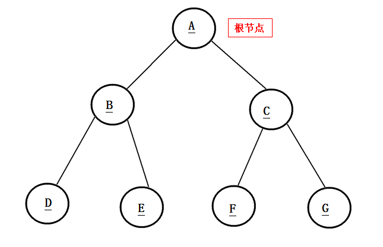
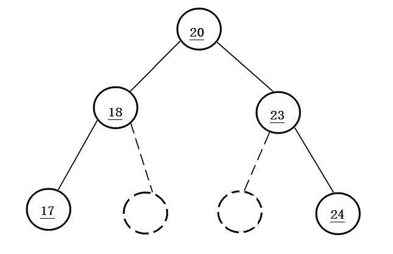

# 1. Set集合

　　Set也是接口，同样继承自接口Collection。Set集合常用的实现类有HashSet、TreeSet和LinkedHashSet。Set接口中没有什么特有的方法。

　　Set集合的特点在于Set集合中元素时唯一的，即不允许集合中存储重复的元素。并且HashSet和TreeSet集合元素是无序的，即元素的存储顺序和取出顺序无关，无固定取出顺序，这与他们的实现原理是相关的，学习之后就会了解。

　　先用HashSet体会一下Set集合，和普通的集合用法都有普遍性。

```java
package com.zhang.test;

import java.util.HashSet;
import java.util.Iterator;

public class Demo {
    public static void main(String[] args) {
        HashSet<String> set = new HashSet<>();
        set.add("hello");
        set.add("world");
        set.add("java");
        // 用迭代器遍历
        // set集合不像List集合有get(index)方法，因此现在只能用迭代器遍历
        for(Iterator<String> it = set.iterator(); it.hasNext(); ) {
            System.out.println(it.next());
        }
        /* 从运行的结果：
        world
        java
        hello
        看，就知道存储与取出顺序不一致了。
        */
    }
}
```

## 1.1 HashSet

　　HashSet的底层数据结构是哈希表（就是元素为链表的数组），线程不安全，效率较高。

　　HashSet的特点是不存储相同的元素，依赖的是对象的hashCode()和equals()方法。最好先研究一下哈希表的结构和存储的过程（数据结构的知识），才好理解下面讲的HashSet的存储原理。

　　HashSet存储数据的步骤如下：

　　（1）当向集合添加一个新对象时，先调用该对象的hashCode()方法得到返回值，由此返回值算出此元素在哈希表中的数组索引，也就是决定了该元素存储在哪个数组中（如果能被添加的话）。

　　（2）如果哈希表中该数组位置还没有元素，那么直接将该元素添加到此索引处，反之，如果此位置已经有元素了（即该元素哈希值和之前添加过来的某元素相同了），那么就调用该对象的equals()方法和该数组索引处所有的元素进行比较，如果此元素和该索引处某元素相等，则此元素不会添加到集合中，否则将此对象添加在该数组索引处，与原来的元素构成链表。

　　通过上述步骤，能够实现HashSet存储的元素唯一。我们可以重写自定义对象的equals()方法，来实现HashSet集合不会存储我们认为的重复的元素，否则HashSet只会根据对象的内存地址判断两个对象是否相等。

　　与此同时，我们也应该重写hashCode()方法，使hashCode()返回值能尽可能区分两个不同的对象，这样能避免链表太长而影响查找元素的效率。一般hashCode()返回该对象所有属性值相加总值的hashCode码。（可参见我之前写的Student类示例）

　　String类本身重写了equals()和hashCode()方法，因此在HashSet<String>对象中，不能存储相同的字符串，可自行实验。

　　调用原理:先判断hashCode() 方法的值,如果相同才会去判断equals 如果不相同,是不会调用equals方法的。

　　当调用add()方法添加元素没有添加成功时，add()返回值是false（已存在相同元素了）。

## 1.2 LinkedHashSet

　　LinkedHashSet底层同样是哈希表和链表，存储的元素是唯一的，这点原理和HashSet都相同，可重写自定义类的hashCode()和equals()方法。LinkedHashSet和HashSet相比，特点就是能保持元素存储顺序和取出顺序的一致性（保证元素有序），可根据需要选用。

## 1.3 TreeSet

　　TreeSet的底层是红黑树结构，红黑树是一种自平衡的二叉树。TreeSet也不能存储相同的元素，TreeSet的特点是能够对元素进行排序。要先了解存储的原理才能明白是怎么实现元素的唯一性和排序的：

　　以下面的代码为例：

```java
package com.zhang.test;

import java.util.TreeSet;

public class Demo {
    public static void main(String[] args) {
        TreeSet<Integer> ts = new TreeSet<>();
        ts.add(20);
        ts.add(18);
        ts.add(23);
        ts.add(17);
        ts.add(18);
        ts.add(24);
        System.out.println(ts);
    }
}
```

　　红黑树的结构是这样的：



　　上图中有A-G共7个节点。TreeSet存储结构就是采用如上图所示意的红黑树结构。现在以上面的代码为例讲解元素是如存储到TreeSet中的。

　　（1）第一次存储元素时，直接创建根节点，把元素存储到根节点中。例子中，即数字20被存储到创建的根节点中（现在还没有创建其他节点，下面的步骤也是，需要的时候创建节点来保存数据，不可能一次就把整棵树都创建好）。

　　（2）从要存储第二个元素开始，每次都将待添加的元素与“根”元素进行比较，如果待添加元素比“根”元素小，则此元素就成为该“根”元素的左孩子；如果待添加元素比“根”元素大，则此元素就成为该元素的右孩子；如果待添加元素和“根”元素相等，则此元素不会被添加进来。如果要添加该元素时，该根元素已经有了左孩子（或右孩子），则再将该左孩子（或右孩子）作为“根”，再重复步骤（2）进行下去……

　　这就是存储的原理。

　　因此，例子中形成的红黑树应该是这样的：



　　当元素从TreeSet遍历取出时，是按照中序遍历的顺序取出的，因此TreeSet能够实现排序。上述的TreeSet例子中存储了Integer数据，JDK已经实现了Integer的排序功能，那么其他的数据类型存储在TreeSet中怎么实现自定义的排序呢？下面就讲如何在TreeSet中实现排序功能。

### 1.3.1 实现TreeSet排序功能

　　实现排序就是定义不同类型对象的排序规则，有两种方式：

　　方式一：使对象自身具有比较性，即自然排序，让创建对象的类实现自然排序接口：Comparable<E>。该接口的方法定义了比较对象的方法，需要自行实现。实现了该接口的对象可以正常添加进TreeSet中。对于Integer等类，JDK已经实现了Comparable接口。因此可直接添加到TreeSet中。

　　代码实例：将Student对象添加到TreeSet集合中，实现方式：自然排序。

　　（1）Student类

```java
package com.zhang.test;

// 实现Comparable接口
public class Student implements Comparable<Student> {
    private String name;
    private int age;

    public String getName() {
        return name;
    }

    public void setName(String name) {
        this.name = name;
    }

    public int getAge() {
        return age;
    }

    public void setAge(int age) {
        this.age = age;
    }

    public Student(){}
    public Student(String name, int age) {
        this.name = name;
        this.age = age;
    }

    public boolean equals(Object obj) {
        if(!(obj instanceof Student)) {
            return false;
        }
        if(obj == this) {
            return true;
        }
        Student stu = (Student) obj;
        if(stu.getName().equals(this.getName()) && stu.getAge() == this.getAge()) {
            // 若姓名和年龄相同，就假定他们是同一对象
            return true;
        } else {
            return false;
        }
    }

    public int hashCode() {
        return this.getName().hashCode() + this.getAge();
    }

    public String toString() {
        return this.getName() + ":" + this.getAge();
    }

    // 实现compareTo方法
    public int compareTo(Student anotherStudent) {
        // 排序方式：先按照
        int compName = this.name.compareTo(anotherStudent.name);
        return compName == 0 ? this.age - anotherStudent.age : compName; // 重要
    }
}
```

　　（2）主类：

```java
package com.zhang.test;

import java.util.TreeSet;

public class Demo {
    public static void main(String[] args) {
        TreeSet<Student> ts = new TreeSet<>();
        ts.add(new Student("张三", 13));
        ts.add(new Student("张三", 14));
        ts.add(new Student("张三", 13));
        System.out.println(ts);
        // 输出结果是：[张三:13, 张三:14]
    }
}
```

　　详细解释：

　　Student类实现了Comparable接口，并使用了泛型，这样实现其中的compareTo()方法时更加方便。

　　compareTo()方法传递了一个本类对象进来，就是用于该类型对象之间的比较。方法返回值是int类型。compareTo(E another)传递进来的就是要比较的对象，在TreeSet中，每次传递进来的就是“根”元素。如果方法返回值是正数，表示该对象比要比较的对象大，如果是负数，就表示该对象比要比较的对象小，如果返回值是0，表示两对象“大小”相等。

　　通过我们的compareTo()的实现，我们能实现对象的“比较”，进而可以将对象添加在TreeSet中进行排序。
在本例中，Student类排序的方式是：先按照学生姓名字符串的字典顺序排序（所以调用String实现的compareTo方法），然后再按照学生的年龄排序。所以compareTo()方法中的第二条语句通过三元运算符判断是否需要比较年龄，因为如果第一次的compName比较结果为0的话，需要再比较年龄，否则就不能以次要条件年龄进行排序了。一般就是这样的写法。

　　下面的第二种方式也要注意这样的写法。

　　注意，如果Student类不实现此接口而直接在TreeSet中添加元素的话，会抛出类型转换异常！

　　方式二：创建TreeSet对象时，向TreeSet传递一个比较器来实现排序功能。适合于元素自身不具备比较性，或者自身具备的比较性不是所需要的情况。比较器排序就是向TreeSet传递一个比较器Comparator<E>接口的实现类。该接口定义了compare的方法，使用上和compareTo()相似。若该比较器只使用一次，则可使用匿名内部类实现。

　　代码实例：还是添加Student，此次的Student不实现Comparable接口。就不贴Student类代码了。

```java
package com.zhang.test;

import java.util.Comparator;
import java.util.TreeSet;

public class Demo {
    public static void main(String[] args) {
        // TreeSet的一个构造函数中可以直接传递比较器
        // 这里使用匿名内部类实现
        TreeSet<Student> ts = new TreeSet<>(new Comparator<Student>() {
            @Override
            public int compare(Student o1, Student o2) {
                int compName = o1.getName().compareTo(o2.getName());
                return compName == 0 ? o1.getAge() - o2.getAge() : compName;
            }
        });

        // 然后就能添加Student对象，此时Student类不需要实现Comparable接口
        ts.add(new Student("张三", 13));
        ts.add(new Student("李四", 13));
        ts.add(new Student("张三", 14));
        ts.add(new Student("张三", 14));
        System.out.println(ts);
    }
}
```

　　解释：

　　这里用了匿名内部类，实现了比较器中的compare(o1, o2)方法，这个方法也是用于对象之间的比较的。该方法的返回值含义和compareTo()相同，只是compare()方法有两个参数，在这里，参数1即o1相当于待添加进来的元素，参数2即o2相当于要比较的根元素。

　　下面是强调的两个注意点：

　　（1）当Comparable和Comparator比较方式同时存在时，以Comparator的比较方式为准。因此比较器适用于自身具备的比较性不是所需要的情况；

　　（2）在重写compareTo或者compare方法时，必须要明确比较的主要条件和次要条件。假设姓名和年龄一致的人为相同的人，如果想要对人按照年龄来排序，那么年龄相同的人需要如何处理？不能直接return 0，因为这样的话，同龄的人就添加不进来了。此时就需要进行次要条件判断（判断姓名），只有姓名和年龄同时相等才能返回0。）即通过return 0来判断唯一性。

# 2. 单例集合Collection的总结

　　需要保存若干个对象可以选用集合。Collection集合下有两大类：List和Set。

　　（1）如果需要保留存储顺序，并且保留重复元素，使用List。

　　　　ArrayList：适合查询较多时使用；LinkedList：适合增删较多时使用。

　　（2）如果需要元素或者排序功能，使用Set。

　　　　HashSet：适合存储无重复的元素；LinkedHashSet：适合无重复并有序元素；TreeSet：适合唯一并且具有排序功能。

# 3. Map集合

## 3.1 介绍

　　Map集合用于存储键值对（key value pair）。键值对即键(key)和值(value)的映射，比如每个学号对应一个学生。其中，键是唯一的，不能重复，值是可以重复的。

　　键很像数组或者List集合的索引，只是数组或List中的索引是从0开始的整数，而在Map集合中，键可以是任意类型的对象。先从例子中看Map集合是什么样的形式。例子中使用的是Map集合的一个常用实现类HashMap。

　　例子：

```java
package com.zhang.test;

import java.util.HashMap;
import java.util.Map;

public class Demo {
    public static void main(String[] args) {
        // 创建Map对象
        Map map = new HashMap();
        // 使用put方法向集合中添加元素
        map.put("20170112", new Student("张三", 14));

        System.out.println(map);
    }
}
```

　　从上面的例子可以看出，向Map集合添加元素是是添加一个键值对（如上例的学号对应的一个学生）。Map集合中的每个元素中其实有“两个”对象，一个对象作为键，一个对象作为值。

　　正是由于每个元素是“两个”对象，因此Map是“双例”集合，而Collection是单例集合。并且Map和Collection接口一样，都是一个顶层接口，他们都没有父接口，因此Map接口并不继承自Collection接口。

　　下面介绍Map接口。首先看API文档中定义的Map接口：

　　interface Map。说明Map也支持泛型，由于是键值对，所以有K和V，K表示键的类型，V表示值的类型。

## 3.2 Map的通用方法

　　（1）添加功能

　　用put方法（而不是add方法）向Map中添加元素。方法原型：

　　V put(K key, V value)：key是键，value是值。如果是第一次存储该键，就直接将键值对添加到集合中，返回null；如果该键已经存在了，就用该新值覆盖该键对应的原本的值，返回覆盖前的值。

　　putAll方法：

　　putAll(Map<? extends K, ? extends V> map)：从指定映射中将所有映射关系复制到此映射中。

　　（2）删除功能

　　void clear()：移除所有的键值对元素。

　　V remove(Object key)：根据键删除键值对元素，并把值返回。

　　（3）判断功能

　　boolean containsKey(Object key)：判断集合是否包含指定的键

　　boolean containsValue(Object value):判断集合是否包含指定的值

　　boolean isEmpty()：判断集合是否为空

　　（4）长度功能

　　int size()：返回集合中的键值对的对数

　　（5）获取功能

　　V get(Object key):根据键获取值

　　Set keySet():获取集合中所有键的集合（得到的是Set集合，因为键是唯一的，可以存储在Set集合中）

　　Collection values():获取集合中所有值的集合（得到的是Collection集合）

　　Set<Entry<K, V>> entrySet():获取键值对对象集合。在下面遍历Map集合时会讲。

## 3.3 Map集合的遍历

　　Map集合不像Collection集合有Iterator迭代器，也不像List集合直接有get(index)方法，因此遍历的方式有所不同。主要有下面两种方式：

　　（1）利用keySet()方法遍历。因为keySet()返回了键的Set集合，那么我们通过遍历Set集合，就也能遍历取出键对应的值。例子：

```java
package com.zhang.test;

import java.util.HashMap;
import java.util.Iterator;
import java.util.Map;
import java.util.Set;

public class Demo {
    public static void main(String[] args) {
        Map<String, Student> stuMap = new HashMap<String, Student>();
        stuMap.put("20170112", new Student("张三", 12));
        stuMap.put("20170113", new Student("李四", 14));
        //先得到键集合
        Set<String> keySet = stuMap.keySet();
        // 遍历
        for(Iterator<String> it = keySet.iterator(); it.hasNext(); ) {
            String str = it.next();
            // 输出
            System.out.println("键：" + str + "， 值：" + stuMap.get(str));
        }
    }
}
```
